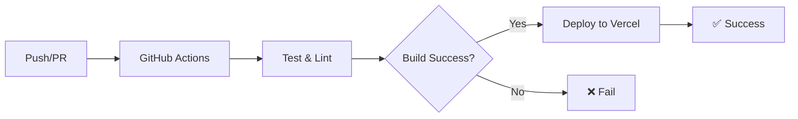

# 🚀 Guia de Deploy - Cajá Talks Interface Design

Este guia completo explica como configurar e executar o deploy automático do projeto.

## 📋 Índice

- [Deploy Automático](#deploy-automático)
- [Configuração Inicial](#configuração-inicial)
- [GitHub Actions](#github-actions)
- [Vercel](#vercel)
- [Deploy Local](#deploy-local)
- [Variáveis de Ambiente](#variáveis-de-ambiente)
- [Troubleshooting](#troubleshooting)

## 🚀 Deploy Automático

O projeto está configurado com **deploy automático** através de:

1. **GitHub Actions** - CI/CD pipeline
2. **Vercel** - Deploy automático em produção
3. **Preview Deployments** - Deploy automático para PRs

### ✅ Status do Deploy Automático

- ✅ **GitHub Actions** configurado
- ✅ **Vercel** configurado
- ✅ **Preview Deployments** ativo
- ✅ **Variáveis de ambiente** configuradas
- ✅ **Scripts de deploy** criados

## 🔧 Configuração Inicial

### 1. Conectar Repositório ao Vercel

1. Acesse [vercel.com](https://vercel.com) e faça login
2. Clique em "New Project"
3. Conecte sua conta do GitHub
4. Selecione o repositório `sptalksv1`
5. Clique em "Import"

### 2. Configurar Secrets no GitHub

Vá em **Settings > Secrets and variables > Actions** e adicione:

```
VERCEL_TOKEN=seu-token-do-vercel
VERCEL_ORG_ID=seu-org-id
VERCEL_PROJECT_ID=seu-project-id
VITE_SUPABASE_URL=https://seu-projeto.supabase.co
VITE_SUPABASE_ANON_KEY=sua-chave-anonima
```

### 3. Configurar Variáveis no Vercel

No painel do Vercel, vá em **Settings > Environment Variables**:

```
VITE_SUPABASE_URL=https://seu-projeto.supabase.co
VITE_SUPABASE_ANON_KEY=sua-chave-anonima
VITE_APP_NAME=Cajá Talks Interface Design
VITE_APP_VERSION=0.1.0
```

## 🔄 GitHub Actions

### Workflows Configurados

#### 1. **CI Pipeline** (`.github/workflows/ci.yml`)
- ✅ Linting e Type Checking
- ✅ Testes automatizados
- ✅ Cobertura de código
- ✅ Auditoria de segurança
- ✅ Build de validação

#### 2. **Deploy Pipeline** (`.github/workflows/deploy.yml`)
- ✅ Deploy automático para `main`
- ✅ Preview deployments para PRs
- ✅ Validação antes do deploy
- ✅ Notificações de status

### Como Funciona



## 🌐 Vercel

### Configuração Otimizada

O `vercel.json` está configurado com:

- ✅ **Build otimizado** para Vite
- ✅ **Headers de segurança**
- ✅ **Cache de assets**
- ✅ **SPA routing**
- ✅ **Environment variables**

### Deploy Automático

- **Push para `main`** → Deploy em produção
- **Pull Request** → Preview deployment
- **Push para `develop`** → Deploy de desenvolvimento

## 🖥️ Deploy Local

### Scripts Disponíveis

```bash
# Deploy para Vercel (produção)
npm run deploy

# Deploy preview para Vercel
npm run deploy:preview

# Deploy local para testes
npm run deploy:local
```

### Scripts Personalizados

#### Linux/Mac
```bash
# Deploy completo
./scripts/deploy.sh

# Deploy preview
./scripts/deploy.sh vercel preview

# Deploy local
./scripts/deploy.sh local
```

#### Windows (PowerShell)
```powershell
# Deploy completo
.\scripts\deploy.ps1

# Deploy preview
.\scripts\deploy.ps1 vercel preview

# Deploy local
.\scripts\deploy.ps1 local
```

## 🔐 Variáveis de Ambiente

### Obrigatórias

```env
VITE_SUPABASE_URL=https://seu-projeto.supabase.co
VITE_SUPABASE_ANON_KEY=sua-chave-anonima
```

### Opcionais

```env
VITE_APP_NAME=Cajá Talks Interface Design
VITE_APP_VERSION=0.1.0
VITE_GOOGLE_ANALYTICS_ID=G-XXXXXXXXXX
VITE_MIXPANEL_TOKEN=seu-token
VITE_ENABLE_ANALYTICS=true
VITE_ENABLE_NOTIFICATIONS=true
VITE_ENABLE_REAL_TIME=true
```

### Como Obter Credenciais do Supabase

1. Acesse [supabase.com](https://supabase.com)
2. Vá em **Settings > API**
3. Copie:
   - **Project URL** → `VITE_SUPABASE_URL`
   - **anon public** key → `VITE_SUPABASE_ANON_KEY`

## 🚀 Como Fazer Deploy

### 1. Deploy Automático (Recomendado)

```bash
# 1. Faça suas alterações
git add .
git commit -m "feat: nova funcionalidade"

# 2. Push para main (deploy automático)
git push origin main

# 3. Ou crie um PR (preview deployment)
git push origin feature/nova-funcionalidade
```

### 2. Deploy Manual

```bash
# Instalar Vercel CLI
npm i -g vercel

# Login no Vercel
vercel login

# Deploy
vercel --prod
```

### 3. Deploy Local para Testes

```bash
# Build e serve local
npm run deploy:local

# Ou usar o script
./scripts/deploy.sh local
```

## 📊 Monitoramento

### Vercel Dashboard

- **Analytics**: Performance e uso
- **Functions**: Logs de runtime
- **Deployments**: Histórico de deploys
- **Domains**: Configuração de domínios

### GitHub Actions

- **Actions**: Status dos workflows
- **Security**: Vulnerabilidades
- **Insights**: Métricas do projeto

## 🔧 Troubleshooting

### Problemas Comuns

#### 1. **Erro de Build**
```bash
# Verificar dependências
npm ci

# Verificar tipos
npm run type-check

# Verificar linting
npm run lint
```

#### 2. **Erro de Variáveis de Ambiente**
```bash
# Verificar se as variáveis estão definidas
echo $VITE_SUPABASE_URL
echo $VITE_SUPABASE_ANON_KEY
```

#### 3. **Erro de Deploy no Vercel**
```bash
# Verificar logs
vercel logs

# Verificar configuração
vercel inspect
```

#### 4. **Erro de CORS**
- Verificar se a URL do Vercel está configurada no Supabase
- Confirmar se as variáveis de ambiente estão corretas

### Logs e Debug

```bash
# Logs do Vercel
vercel logs

# Logs do GitHub Actions
# Vá em Actions > [Workflow] > [Job] > View logs

# Build local com debug
npm run build -- --debug
```

## 📈 Performance

### Otimizações Implementadas

- ✅ **Code Splitting** automático
- ✅ **Tree Shaking** ativo
- ✅ **Minificação** de assets
- ✅ **Compressão** gzip
- ✅ **Cache** de assets
- ✅ **CDN** global

### Métricas Alvo

- **First Contentful Paint**: < 1.5s
- **Largest Contentful Paint**: < 2.5s
- **Cumulative Layout Shift**: < 0.1
- **Time to Interactive**: < 3.5s

## 🔄 Atualizações

### Atualizar Variáveis de Ambiente

1. **Vercel**: Settings > Environment Variables
2. **GitHub**: Settings > Secrets and variables > Actions
3. **Redeploy** para aplicar mudanças

### Atualizar Código

```bash
git add .
git commit -m "feat: atualização"
git push origin main
# Deploy automático será executado
```

## 📚 Recursos Adicionais

- [Documentação do Vercel](https://vercel.com/docs)
- [GitHub Actions](https://docs.github.com/en/actions)
- [Supabase + Vercel](https://supabase.com/docs/guides/getting-started/tutorials/with-nextjs)
- [Vite Deploy Guide](https://vitejs.dev/guide/static-deploy.html)

## ✅ Checklist de Deploy

- [ ] Repositório conectado ao Vercel
- [ ] Secrets configurados no GitHub
- [ ] Variáveis de ambiente configuradas
- [ ] Supabase configurado
- [ ] CORS configurado
- [ ] Build executado com sucesso
- [ ] Deploy automático funcionando
- [ ] Preview deployments ativos
- [ ] Monitoramento configurado

---

**🎉 Deploy configurado com sucesso!**

O projeto agora tem deploy automático configurado e funcionando. Qualquer push para `main` fará deploy automático em produção, e PRs terão preview deployments automáticos.
